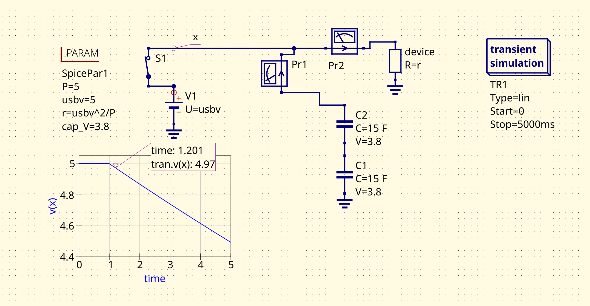

# POwer Shield

Power Shield to to projekt urządzenia zapewniającego soft-shutdown (bezpieczne wyłączenie) dla mikrokontrolerów/mikrokomputerów.

## Cel projektu

W dzisiejszych czasach, coraz popularniejsze staje wię wykorzystanie
urządzeń IoT (Internet of Things) w większości bazujących na mikrokontrolerach (takich jak ESP32) lub
minikomputerach (Raspberry Pi).
W większości przypadków nagłe zaniki zasilania na takich urządzeniach nie są problemem, jednak można znaleźć
kilka przykładów w których, dostarczona choćby z niewielkim wyprzedzeniem informacja o "planowanym" zaniku zasilania
może okazać się bezcenna.
Przykłądy rozważane w projekcie:

### Druk 3D

Druk 3D w technologii FDM polega na wykonywaniu przez maszynę (drukarkę) kolejno instrukcji z pliku źródłowego (najczęściej w formacie GCode).
Wiele takich maszyn wykorzystuje oprogramowanie Klipper. W takim ustawieniu, główne obliczenia związane z drukiem wykonywane są na minikomputerze Rspberry PI.
W razie zaniku prądu informacja o obecnym stanie druku jest bezpowrotnie tracona. Można oczywiście zapisywać ją co krótki krok czasowy (~1s) na dysku (karta SD), jednak
doprowadzi to do szybkiej degradacji takiej pamięci (w przypadku kart SD około 10^5 cykli czyli około 27 godzin).

Podejście proponowane w projekcie zakłąda podtrzymanie zasilania mikrokomputera przez pewien czas przy jednoczesnym dostarczeniu informacji, tak
aby można było dokonać jednorazowego zapisu pozycji na karcie.

# Prove of Concept

W sklepie LCSC Electronics dostępne są [superkondensatory o pojemności 20F](https://www.lcsc.com/product-detail/C970391.html)

Poniższy zrzut ekranu z symulatora przedstawia przybliżone zachowanie układu w razie zaniku zasilania.

Prawdopodobnie przy dodaniu odpowiedniej detekcji (komunikacja przez GPIO) uda się osiągnąć wystarczająco czasu przy stabilnym zasilaniu aby dokonać zapisu niezbędnych danych na karcie SD (i ewentualnie "w miarę bezpiecznie" wyłączyć urządzenie).
